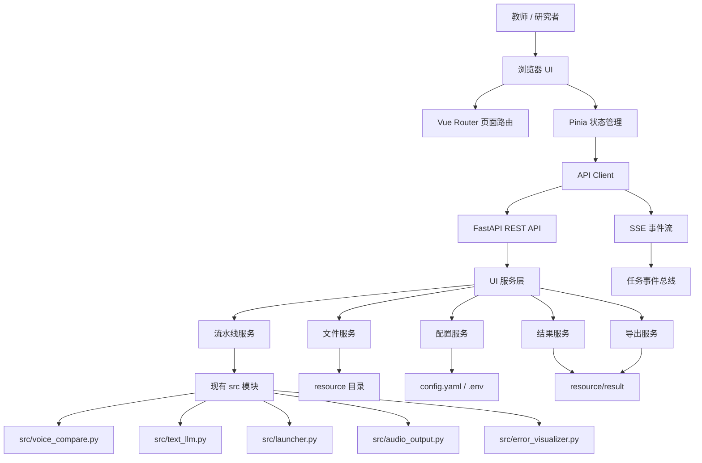
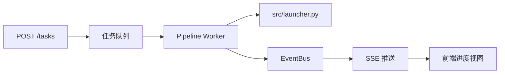
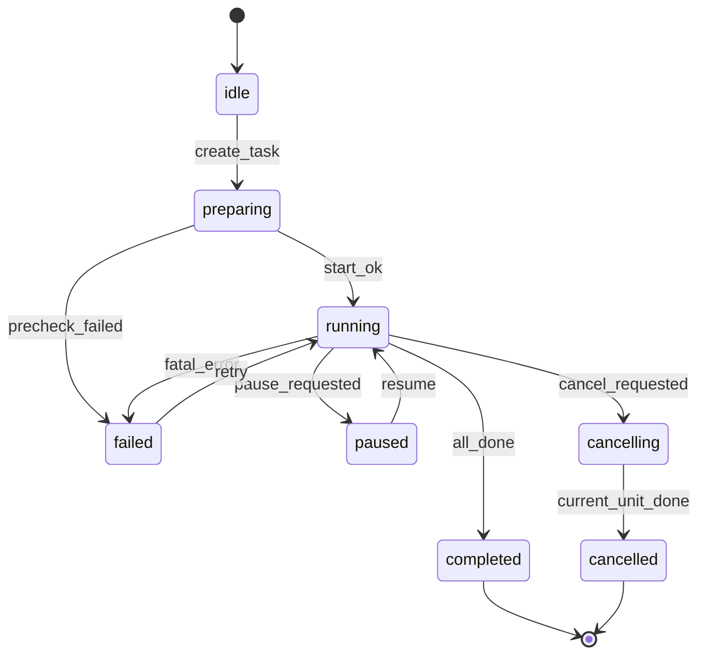
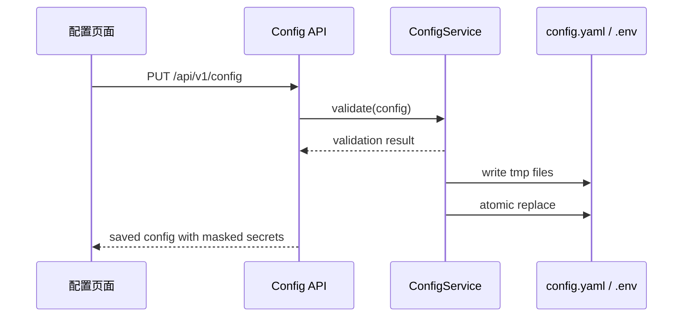

# 语音仿读质量评估系统 — UI 技术架构说明书

> 版本：v1.0 | 日期：2026-07-09 | 状态：架构设计

---

## 1. 文档定位

本文档基于 `doc/UI需求书.md` 扩展，面向 UI 项目的设计、开发、测试与后续维护，目标是把“本地 Web 图形界面包装现有命令行程序”的产品需求细化为可落地的技术方案。

本文档重点回答以下问题：

| 问题 | 说明 |
|------|------|
| 系统如何分层 | 明确前端、后端、服务层、现有业务模块之间的职责边界 |
| 如何集成现有代码 | 在尽量不改动 `src/` 主体逻辑的前提下，为 UI 提供稳定调用接口 |
| 如何管理长任务 | 说明流水线启动、进度推送、暂停取消、失败重试、断点续传机制 |
| 如何组织数据 | 明确资源目录、结果目录、临时文件、配置文件与未来数据库之间的关系 |
| 如何演进 | 从 Phase 1 单用户本地应用平滑扩展到师生双端和校级平台 |

---

## 2. 总体架构

### 2.1 架构结论

UI 项目采用 **FastAPI + Vue 3 + TypeScript** 的本地 Web 应用架构：

- 后端继续使用 Python，便于直接调用现有 `src/` 语音分析、转写、LLM 比对、结果汇总模块。
- 前端使用 Vue 3 构建现代化管理界面，浏览器作为 UI 容器。
- 用户通过 `python run_ui.py` 启动本地服务，浏览器访问 `http://localhost:8000`。
- Phase 1 不引入数据库，继续以 `resource/` 文件系统作为事实数据源。
- 长任务通过后端任务队列执行，进度通过 SSE 推送给前端。

### 2.2 分层视图



### 2.3 核心原则

| 原则 | 说明 |
|------|------|
| 薄封装 | UI 服务层只做参数校验、文件管理、任务编排和结果聚合，不复制现有算法逻辑 |
| 文件优先 | Phase 1 继续复用现有 `resource/` 目录结构，降低迁移成本 |
| 长任务隔离 | 流水线任务在后端后台线程或进程中执行，避免阻塞 API 请求 |
| 事件驱动 | 任务进度、日志、错误、完成状态统一转换为事件并推送前端 |
| 渐进式改造 | 只对现有模块增加必要的可选回调、返回值和配置写入能力，保持命令行兼容 |
| 可替换前端 | 前端只依赖 `/api/v1` 和 `/events`，不直接关心后端内部文件布局 |

---

## 3. 推荐技术栈

### 3.1 后端技术栈

| 类型 | 技术 | 用途 |
|------|------|------|
| Web 框架 | FastAPI | REST API、SSE、静态资源托管 |
| ASGI 服务 | Uvicorn | 本地开发和运行服务 |
| 数据模型 | Pydantic | 请求、响应、配置、事件模型校验 |
| 文件处理 | pathlib / shutil / csv / pandas | 上传、复制、校验、结果读取 |
| 后台任务 | threading + queue | Phase 1 单机任务队列 |
| 配置处理 | PyYAML + python-dotenv | 读写 `config.yaml` 和 `.env` |
| 日志 | logging | 统一日志格式，供 UI 实时订阅和落盘 |
| 打包 | PyInstaller | 可选的一键分发包 |

### 3.2 前端技术栈

| 类型 | 技术 | 用途 |
|------|------|------|
| 框架 | Vue 3 | 页面和组件开发 |
| 语言 | TypeScript | 类型约束，提高长期维护性 |
| 构建 | Vite | 开发服务器、生产构建 |
| 路由 | Vue Router | 页面导航 |
| 状态 | Pinia | 任务、配置、结果等全局状态 |
| UI 组件 | Naive UI 或 Element Plus | 表格、表单、弹窗、通知、上传控件 |
| 图表 | ECharts 5 | 雷达图、折线图、直方图、词云等 |
| HTTP | Fetch API 或 Axios | REST API 调用 |
| 实时通信 | EventSource | 接收 SSE 任务事件 |

### 3.3 组件库选择建议

优先选择 **Naive UI**，理由如下：

| 维度 | Naive UI | Element Plus |
|------|----------|--------------|
| 视觉风格 | 更现代、轻量，适合定制学术工具界面 | 更偏传统后台管理系统 |
| TypeScript | 类型体验较好 | 成熟稳定 |
| 暗色模式 | 内置支持较完整 | 支持但定制略重 |
| 表格能力 | 满足 Phase 1 需求 | 生态和案例更多 |
| 团队风险 | 中低 | 低 |

若开发团队更熟悉 Element Plus，可优先采用 Element Plus。架构不绑定具体组件库。

---

## 4. 目录结构设计

### 4.1 新增目录建议

```text
opensmile_test/
  run.py                         # 现有命令行入口，保留
  run_ui.py                      # 新增 UI 启动入口
  src/                           # 现有业务模块，尽量保持稳定
  server/                        # 新增 FastAPI Web 层
    __init__.py
    main.py                      # FastAPI 应用工厂与静态资源挂载
    deps.py                      # 公共依赖，如服务实例、路径上下文
    api/
      __init__.py
      v1/
        __init__.py
        files.py                 # 素材管理 API
        config.py                # 配置中心 API
        tasks.py                 # 任务控制 API
        results.py               # 结果查询 API
        exports.py               # 导出 API
        health.py                # 健康检查 API
    events/
      __init__.py
      sse.py                     # SSE 连接和事件订阅
    schemas/
      __init__.py
      common.py                  # 通用响应模型
      files.py
      config.py
      tasks.py
      results.py
      events.py
  services/                      # 新增 UI 服务层
    __init__.py
    app_context.py               # 路径、运行时状态、服务配置
    file_service.py              # 文件上传、校验、移动、删除
    config_service.py            # 配置读取、保存、预设
    pipeline_service.py          # 流水线任务编排
    task_store.py                # 当前任务状态和历史任务快照
    event_bus.py                 # 后端内部事件发布订阅
    result_service.py            # summary、markdown、json、png 聚合读取
    export_service.py            # Excel、PDF、图片导出
    health_service.py            # 依赖检测
  ui/                            # Vue 3 前端项目
    package.json
    vite.config.ts
    index.html
    src/
      main.ts
      App.vue
      router/
      stores/
      api/
      views/
      components/
      charts/
      styles/
      types/
  resource/                      # 现有数据目录，Phase 1 继续作为数据源
```

### 4.2 目录职责边界

| 目录 | 职责 | 不应承担的职责 |
|------|------|----------------|
| `src/` | 现有评估算法、流水线、后处理 | 不直接处理 HTTP 请求，不依赖前端 |
| `services/` | UI 适配、任务编排、文件和配置服务 | 不重新实现 OpenSMILE / Whisper / LLM 比对算法 |
| `server/` | API 路由、请求响应、SSE、静态文件托管 | 不包含复杂业务逻辑 |
| `ui/` | 页面、组件、状态、图表、交互 | 不直接访问本地文件系统 |
| `resource/` | 输入素材、运行结果、历史数据 | 不存放前端源码和后端运行代码 |

---

## 5. 后端架构设计

### 5.1 FastAPI 应用入口

`server/main.py` 建议采用应用工厂模式：

| 模块 | 职责 |
|------|------|
| `create_app()` | 创建 FastAPI 实例，注册中间件、路由、异常处理器 |
| `register_routes(app)` | 注册 `/api/v1` 和 `/events` 路由 |
| `mount_static(app)` | 生产环境挂载 `ui/dist` 静态资源 |
| `lifespan` | 启动时初始化路径上下文、任务队列、健康检查；关闭时安全停止任务 |

### 5.2 服务层职责

#### 5.2.1 FileService

负责素材和知识库文件管理：

- 标准音频上传、替换、删除、元数据读取。
- 标准文本上传、编辑、保存、句数和词数统计。
- 学生音频批量导入、命名校验、重复文件处理。
- 知识库 CSV 上传、表格化读取、列校验。
- 对所有写操作先写入临时文件，再原子替换，避免半写入状态。

学生音频命名校验规则：

| 项 | 规则 |
|----|------|
| 文件名 | `{姓名}-{10位学号}.{ext}` |
| 姓名 | 非空，允许中文、英文、少量连接符 |
| 学号 | 10 位数字 |
| 扩展名 | `wav`、`mp3`、`m4a`，可按现有系统能力扩展 |
| 重复处理 | 默认提示覆盖，可选择跳过或重命名 |

#### 5.2.2 ConfigService

负责配置读写和表单模型转换：

- 读取 `resource/config.yaml` 中的模型、路径、词云、可视化等配置。
- 读取 `.env` 中的 LLM、Whisper、模块开关等运行配置。
- 将 UI 表单字段映射为后端配置字段。
- 保存配置前进行校验，防止写入不可运行的配置。
- 支持配置预设，Phase 1 可保存在 `resource/config_presets/`。

API Key 存储策略：

| 阶段 | 策略 |
|------|------|
| Phase 1 | 优先写入 `.env`，UI 只返回掩码值，不返回明文 |
| Phase 1 增强 | 使用 Windows Credential Manager 或 keyring 库存储 |
| Phase 2 | 用户级密钥加密存储，结合数据库和服务端密钥 |

#### 5.2.3 PipelineService

负责任务全生命周期：

- 创建任务：检查素材、生成任务 ID、记录执行模块、初始化状态。
- 启动任务：提交到后台任务队列执行。
- 进度桥接：接收现有流水线的进度回调或解析日志，转换为标准任务事件。
- 暂停任务：设置暂停标志，等待当前学生处理完成后停止调度后续学生。
- 取消任务：安全设置取消标志，保留已完成结果和 progress 状态。
- 失败重试：针对单学生或单阶段重新入队。
- 断点续传：读取 `resource/result/progress.json` 并转换为 UI 可读状态。

#### 5.2.4 ResultService

负责把静态结果文件转换为 UI 数据：

- 读取 `resource/result/summary.csv` 或 Excel 汇总表。
- 解析每个学生目录下的 Markdown 报告。
- 读取 `{学生}_errors.json`，聚合 replace / insert / delete 错误。
- 读取图表 PNG，或为 ECharts 生成可视化数据。
- 读取 `resource/result/history/` 中的历史批次。
- 为前端提供分页、排序、筛选后的结构化响应。

#### 5.2.5 ExportService

负责导出：

- 复用现有后处理结果导出 Excel。
- 将前端筛选条件转换为导出参数。
- 生成个人报告打印数据。
- Phase 1 PDF 导出可由浏览器打印完成，后端只提供 HTML 报告数据。

#### 5.2.6 HealthService

负责依赖和环境检查：

- Python 版本、虚拟环境状态。
- OpenSMILE 是否可导入。
- Whisper 模型目录是否存在。
- LLM API Key 是否存在，API 是否可连通。
- `resource/` 关键目录是否存在且可写。

### 5.3 任务执行模型

Phase 1 推荐采用单进程、多线程的简洁模型：



| 设计点 | 说明 |
|--------|------|
| 同一时间只运行一个评估任务 | 避免 OpenSMILE、Whisper 模型、结果目录并发写冲突 |
| 任务线程不处理 HTTP 请求 | API 只负责创建和控制任务，长任务由 worker 执行 |
| 任务状态集中存储 | `TaskStore` 保存当前任务快照，方便刷新页面后恢复 |
| 日志统一转事件 | 运行日志既写入文件，也推送 UI 实时日志面板 |

### 5.4 与现有流水线的集成方式

推荐对 `src/launcher.py` 做最小可选扩展：

| 扩展点 | 说明 | 是否影响命令行 |
|--------|------|----------------|
| `progress_cb` | 阶段开始、学生完成、失败、结束时触发回调 | 不影响，默认为 `None` |
| `cancel_event` | 后台任务取消信号，阶段间检查 | 不影响，默认为 `None` |
| `pause_event` | 暂停信号，学生级任务间检查 | 不影响，默认为 `None` |
| 返回任务摘要 | 返回成功人数、失败人数、耗时、输出路径 | 命令行可忽略返回值 |

如果短期不改 `launcher.py`，可先通过两种兼容方式接入：

| 方式 | 优点 | 缺点 |
|------|------|------|
| 子进程运行 `python run.py` 并解析 stdout | 改动最小 | 进度粒度受日志格式限制，取消较粗糙 |
| 直接调用 `launcher.main()` 并捕获日志 | 与 Python 对象集成更自然 | 需要梳理 launcher 入口和全局状态 |

长期推荐直接函数调用 + 可选回调，这样任务状态最准确。

---

## 6. 前端架构设计

### 6.1 页面路由

| 路由 | 页面 | 对应需求 |
|------|------|----------|
| `/` | 仪表盘 | 系统状态、快捷入口、最近批次 |
| `/files` | 素材管理 | 标准音频、标准文本、学生音频、知识库 |
| `/config` | 配置中心 | LLM、Whisper、模块开关、词云参数 |
| `/tasks` | 任务控制 | 启动、进度、日志、失败重试 |
| `/results` | 结果总览 | 成绩表、统计卡片、分布图 |
| `/students/:studentId` | 学生详情 | 个人报告、语音图表、错误列表 |
| `/errors` | 错题分析 | 词云、错误词频、知识点关联 |
| `/history` | 历史追踪 | 批次列表、进步曲线、批次对比 |
| `/export` | 数据导出 | Excel、图表、个人报告 |

### 6.2 前端模块结构

```text
ui/src/
  api/
    http.ts                 # REST 基础封装
    sse.ts                  # EventSource 封装
    files.ts
    config.ts
    tasks.ts
    results.ts
    exports.ts
  stores/
    appStore.ts             # 主题、全局加载态、导航状态
    fileStore.ts            # 素材元数据
    configStore.ts          # 配置表单状态
    taskStore.ts            # 当前任务、进度、日志
    resultStore.ts          # 汇总结果、筛选条件
  views/
    DashboardView.vue
    FileManagerView.vue
    ConfigEditorView.vue
    TaskRunnerView.vue
    ResultOverviewView.vue
    StudentDetailView.vue
    ErrorAnalysisView.vue
    HistoryTrackerView.vue
    ExportView.vue
  components/
    layout/
    files/
    config/
    tasks/
    results/
    charts/
    common/
  types/
    api.ts
    file.ts
    config.ts
    task.ts
    result.ts
```

### 6.3 状态管理策略

| 状态类型 | 存储位置 | 示例 |
|----------|----------|------|
| 服务端事实状态 | 后端文件系统 / TaskStore | 任务进度、结果数据、配置文件 |
| 前端全局状态 | Pinia | 当前任务、主题、筛选条件、用户选择 |
| 页面临时状态 | 组件内部 | 弹窗开关、表单编辑草稿、上传进度 |
| 可恢复偏好 | localStorage | 主题、表格列可见性、最近打开页面 |

前端刷新页面后必须能通过 API 恢复关键状态：

- 当前是否有运行中任务。
- 任务执行到哪个阶段。
- 已产生哪些结果。
- 配置是否已保存。

### 6.4 图表设计

| 图表 | 数据来源 | 实现方式 |
|------|----------|----------|
| 语音雷达图 | 学生语音评分、标准分 | ECharts radar |
| 3×3 声学对比图 | 现有 PNG 或后端结构化特征数据 | Phase 1 可先展示 PNG，后续迁移 ECharts |
| 成绩直方图 | summary 聚合 | ECharts bar |
| 各维度箱线图 | summary 各维度列 | ECharts boxplot |
| 三分类词云 | errors.json 聚合 | ECharts wordcloud 插件或后端生成 PNG |
| 历史进步曲线 | history summary | ECharts line |

图表演进建议：

| 阶段 | 策略 |
|------|------|
| MVP | 直接展示现有 PNG，保证结果可见 |
| Phase 1 完整版 | 对 summary、errors、history 生成 ECharts 交互图 |
| Phase 1 增强版 | 将 voice_compare 的关键特征序列输出为 JSON，实现可缩放声学曲线 |

### 6.5 交互与布局

UI 应采用“左侧导航 + 顶部状态栏 + 主内容区”的工作台布局：

| 区域 | 内容 |
|------|------|
| 左侧导航 | 仪表盘、素材、配置、任务、结果、错题、历史、导出 |
| 顶部状态栏 | 当前素材状态、任务状态、主题切换、全局通知 |
| 主内容区 | 当前页面内容，表格和图表优先保证可扫描性 |
| 右侧抽屉 | 学生详情、错误详情、配置说明等辅助信息 |

设计上应避免营销式首页，首屏直接进入可操作的仪表盘。

---

## 7. API 设计

### 7.1 通用响应格式

```json
{
  "success": true,
  "data": {},
  "message": "ok",
  "request_id": "20260709-abcdef"
}
```

错误响应：

```json
{
  "success": false,
  "error": {
    "code": "INVALID_STUDENT_FILENAME",
    "message": "学生音频文件名不符合 {姓名}-{10位学号} 规则",
    "details": {
      "filename": "student1.wav"
    }
  },
  "request_id": "20260709-abcdef"
}
```

### 7.2 健康检查 API

| 方法 | 路径 | 说明 |
|------|------|------|
| GET | `/api/v1/health` | 基础服务状态 |
| GET | `/api/v1/health/dependencies` | OpenSMILE、Whisper、LLM、目录权限检查 |

### 7.3 文件 API

| 方法 | 路径 | 说明 |
|------|------|------|
| GET | `/api/v1/files/status` | 获取标准素材、学生音频、知识库状态 |
| POST | `/api/v1/files/standard-audio` | 上传或替换标准音频 |
| DELETE | `/api/v1/files/standard-audio/{filename}` | 删除标准音频 |
| GET | `/api/v1/files/standard-text` | 获取标准文本内容 |
| PUT | `/api/v1/files/standard-text` | 保存标准文本 |
| POST | `/api/v1/files/student-audios` | 批量上传学生音频 |
| GET | `/api/v1/files/student-audios` | 获取学生音频列表 |
| DELETE | `/api/v1/files/student-audios/{student_id}` | 删除指定学生音频 |
| POST | `/api/v1/files/knowledge` | 上传知识库 CSV |
| GET | `/api/v1/files/knowledge` | 表格化读取知识库 |

### 7.4 配置 API

| 方法 | 路径 | 说明 |
|------|------|------|
| GET | `/api/v1/config` | 获取完整 UI 配置模型 |
| PUT | `/api/v1/config` | 保存配置 |
| POST | `/api/v1/config/validate` | 仅校验配置，不保存 |
| POST | `/api/v1/config/reset` | 恢复默认配置 |
| GET | `/api/v1/config/presets` | 获取配置预设列表 |
| POST | `/api/v1/config/presets` | 保存当前配置为预设 |
| POST | `/api/v1/config/presets/{preset_id}/apply` | 应用指定预设 |

### 7.5 任务 API

| 方法 | 路径 | 说明 |
|------|------|------|
| POST | `/api/v1/tasks` | 创建并启动评估任务 |
| GET | `/api/v1/tasks/current` | 获取当前任务快照 |
| POST | `/api/v1/tasks/{task_id}/pause` | 暂停任务 |
| POST | `/api/v1/tasks/{task_id}/resume` | 继续任务 |
| POST | `/api/v1/tasks/{task_id}/cancel` | 取消任务 |
| POST | `/api/v1/tasks/{task_id}/retry` | 重试失败学生或阶段 |
| GET | `/api/v1/tasks/{task_id}/logs` | 获取历史日志 |

创建任务请求示例：

```json
{
  "modules": {
    "filter_precheck": true,
    "voice_analysis": true,
    "whisper_transcribe": true,
    "llm_compare": true,
    "post_process": true,
    "error_visualize": true
  },
  "student_ids": ["2220244066", "2220243089"],
  "resume_from_progress": true
}
```

### 7.6 结果 API

| 方法 | 路径 | 说明 |
|------|------|------|
| GET | `/api/v1/results/summary` | 获取成绩总表，支持分页、排序、筛选 |
| GET | `/api/v1/results/statistics` | 班级统计卡片数据 |
| GET | `/api/v1/results/students/{student_id}` | 获取学生详情 |
| GET | `/api/v1/results/students/{student_id}/report` | 获取 Markdown 报告渲染数据 |
| GET | `/api/v1/results/students/{student_id}/errors` | 获取学生错误列表 |
| GET | `/api/v1/results/errors/aggregate` | 获取全班错误聚合 |
| GET | `/api/v1/results/history` | 获取历史批次列表 |
| GET | `/api/v1/results/history/{batch_id}` | 获取指定历史批次 |

### 7.7 导出 API

| 方法 | 路径 | 说明 |
|------|------|------|
| POST | `/api/v1/exports/summary-excel` | 导出 Excel 汇总 |
| POST | `/api/v1/exports/student-report` | 导出单个学生报告数据 |
| POST | `/api/v1/exports/charts` | 批量导出图表 |

### 7.8 SSE 事件 API

| 方法 | 路径 | 说明 |
|------|------|------|
| GET | `/events/tasks/{task_id}` | 订阅指定任务事件 |
| GET | `/events/system` | 订阅系统级事件，如依赖检查完成 |

任务事件格式：

```json
{
  "event_id": "evt_20260709_000001",
  "task_id": "task_20260709_134018",
  "type": "stage_progress",
  "timestamp": "2026-07-09T13:40:18+08:00",
  "payload": {
    "stage": "voice_analysis",
    "stage_label": "语音分析",
    "current": 12,
    "total": 45,
    "student_id": "2220244066",
    "student_name": "常松",
    "status": "running"
  }
}
```

---

## 8. 任务状态与进度设计

### 8.1 任务状态机



### 8.2 学生级状态

| 状态 | 说明 |
|------|------|
| `pending` | 等待处理 |
| `running` | 当前正在处理 |
| `done` | 已完成 |
| `failed` | 当前学生处理失败 |
| `skipped` | 因模块关闭或断点续传跳过 |
| `cancelled` | 任务取消后未继续处理 |

### 8.3 阶段定义

UI 应以现有 8 阶段流水线为准，展示时可映射为中文名称：

| 阶段标识 | UI 名称 | 说明 |
|----------|---------|------|
| `init` | 初始化 | 加载配置、扫描目录、准备运行环境 |
| `filter_precheck` | 预检查 | 对比音频文件列表与已有记录 |
| `voice_analysis` | 语音分析 | OpenSMILE 声学特征分析 |
| `whisper_transcribe` | 语音转写 | Whisper 将学生录音转为文本 |
| `llm_compare` | 文本比对 | LLM 比对标准文本与转写文本 |
| `post_process` | 后处理 | 汇总报告、Excel、CSV |
| `history_snapshot` | 历史归档 | 保存历史批次数据 |
| `error_visualize` | 错题可视化 | 词云和进步曲线生成 |

如现有 `src/launcher.py` 中阶段编号与上表不一致，以代码实际阶段为准，UI 显示层只做名称映射。

### 8.4 进度精度

| 层级 | 进度来源 | UI 展示 |
|------|----------|---------|
| 任务级 | 已完成阶段数 / 总阶段数 | 顶部总进度条 |
| 阶段级 | 当前阶段已完成学生数 / 总学生数 | 阶段卡片进度 |
| 学生级 | voice / text / report 子状态 | 可展开学生表格 |
| 日志级 | logging 事件 | 实时日志面板 |

---

## 9. 数据与文件设计

### 9.1 Phase 1 数据源

Phase 1 不引入数据库，继续使用现有目录作为数据源：

| 数据类型 | 位置 | 读写方 |
|----------|------|--------|
| 标准音频 | `standard_audio/` 或配置指定目录 | FileService / 现有语音模块 |
| 标准文本 | `standard_text/standard.txt` | FileService / text_llm |
| 学生音频 | `resource/imitation_audio/` | FileService / launcher |
| 知识库 | `resource/knowledge/learning_source.csv` | FileService / text_llm |
| 运行配置 | `resource/config.yaml`、`.env` | ConfigService / src/config.py |
| 进度状态 | `resource/result/progress.json` | PipelineService / launcher |
| 汇总结果 | `resource/result/summary.csv`、Excel | ResultService / audio_output |
| 学生报告 | `resource/result/{姓名-学号}/` | ResultService / text_llm / voice_compare |
| 历史批次 | `resource/result/history/` | ResultService / launcher |

### 9.2 UI 运行时文件

建议新增运行时目录：

```text
resource/runtime/
  logs/
    ui_server.log
    tasks/
      task_20260709_134018.log
  tasks/
    current_task.json
    task_20260709_134018.json
  uploads/
    tmp/
  config_presets/
    quick_test.yaml
    formal_eval.yaml
```

| 文件 | 说明 |
|------|------|
| `current_task.json` | 当前任务快照，服务重启后恢复 UI 状态 |
| `task_*.json` | 任务历史元数据，不替代评估结果 |
| `task_*.log` | 任务日志，供 UI 日志面板读取 |
| `uploads/tmp/` | 上传过程临时文件，成功后移动到正式目录 |
| `config_presets/` | UI 配置预设 |

### 9.3 文件写入安全

所有 UI 发起的文件写入应遵循：

1. 写入临时目录。
2. 校验文件名、格式、大小、编码。
3. 如目标已存在，按用户选择覆盖、跳过或保留两者。
4. 覆盖时先备份旧文件。
5. 使用原子替换移动到正式目录。
6. 写入操作记录到日志。

### 9.4 未来数据库演进

Phase 2 引入用户系统后，建议新增数据库，但不立即迁移全部原始文件：

| 数据 | Phase 1 | Phase 2 |
|------|---------|---------|
| 用户、班级、任务 | 无 | 数据库 |
| 上传音频 | 文件系统 | 文件系统 + 数据库索引 |
| 评估结果 | 文件系统 | 文件系统 + 数据库摘要 |
| 配置 | YAML / .env | 数据库用户配置 + 环境变量 |
| 日志 | 文件 | 文件 + 数据库审计摘要 |

---

## 10. 配置架构

### 10.1 配置分层

| 层级 | 来源 | 示例 | UI 是否可编辑 |
|------|------|------|----------------|
| 系统默认配置 | 代码默认值 | 默认路径、默认模型 | 否 |
| 项目配置 | `resource/config.yaml` | 词云参数、路径、可视化参数 | 是 |
| 环境配置 | `.env` | API Key、模块开关、模型选择 | 是，敏感值掩码 |
| 运行时覆盖 | 创建任务请求 | 本次执行模块、学生范围 | 是，仅当前任务有效 |
| 前端偏好 | localStorage | 主题、列显示、排序 | 是，仅 UI 有效 |

### 10.2 配置保存流程



### 10.3 敏感配置

| 配置 | 前端展示 | 后端存储 | 日志策略 |
|------|----------|----------|----------|
| LLM API Key | 只显示掩码 | `.env` 或 keyring | 永不打印明文 |
| API Base URL | 明文 | `.env` | 可打印 |
| 模型名称 | 明文 | `.env` / yaml | 可打印 |
| 并发数 | 明文 | `.env` / yaml | 可打印 |

---

## 11. 安全与权限

### 11.1 Phase 1 本地安全边界

Phase 1 是单用户本地应用，不提供远程登录和公网访问能力。默认监听地址应为 `127.0.0.1`，避免局域网其他设备访问。

| 风险 | 策略 |
|------|------|
| 本地文件误删 | 删除、覆盖、取消任务均需二次确认 |
| 路径穿越 | 所有 API 路径参数必须限制在项目允许目录内 |
| 大文件占满磁盘 | 上传前检查大小，运行前检查剩余空间 |
| API Key 泄漏 | 响应、日志、异常堆栈中统一脱敏 |
| 非法文件格式 | 白名单扩展名 + MIME / 文件头辅助校验 |

### 11.2 Phase 2 权限模型预留

| 角色 | 权限 |
|------|------|
| 教师 | 创建任务、上传素材、查看班级结果、导出报告 |
| 学生 | 查看任务、上传个人录音、查看个人报告 |
| 管理员 | 用户管理、系统配置、审计日志 |

Phase 1 的 API 路由可先不接入鉴权，但应避免把教师、学生、管理员逻辑硬编码进页面组件，便于后续接入 RBAC。

---

## 12. 可靠性设计

### 12.1 崩溃恢复

服务启动时执行恢复流程：

1. 读取 `resource/runtime/tasks/current_task.json`。
2. 读取 `resource/result/progress.json`。
3. 判断是否存在未完成任务。
4. 前端仪表盘展示“发现未完成任务”。
5. 用户选择继续、重新开始或仅查看已生成结果。

### 12.2 失败隔离

| 失败类型 | UI 行为 | 后端行为 |
|----------|---------|----------|
| 单学生语音分析失败 | 学生行标红，可重试 | 记录 failed，不中断全局任务 |
| LLM API 超时 | 日志警告，可自动重试 | 指数退避，达到次数后标记失败 |
| 配置校验失败 | 阻止启动，定位字段 | 返回结构化错误 |
| 结果文件缺失 | 页面显示缺失状态 | 不抛出 500，返回 partial data |
| 磁盘写入失败 | 弹出错误，停止任务 | 安全停止并保留已有文件 |

### 12.3 日志分级

| 级别 | 用途 | UI 样式 |
|------|------|---------|
| DEBUG | 开发调试，默认隐藏 | 灰色，可开关显示 |
| INFO | 正常进度 | 默认文本 |
| WARNING | 可恢复问题 | 黄色标记 |
| ERROR | 单项失败 | 红色标记 |
| CRITICAL | 系统级失败 | 红色高亮 + 弹窗 |

---

## 13. 性能设计

### 13.1 后端性能

| 场景 | 策略 |
|------|------|
| 大音频上传 | 流式接收，显示上传进度，避免一次性读入内存 |
| 结果总表 | 后端分页、排序、筛选，前端虚拟滚动 |
| Markdown 报告 | 按学生懒加载，避免一次读取全部报告 |
| 图表资源 | 缩略图优先，详情页再加载高清图 |
| Whisper 模型 | 服务启动后预热，任务间复用单例 |
| LLM 并发 | 由配置限制最大并发，UI 展示当前并发策略 |

### 13.2 前端性能

| 场景 | 策略 |
|------|------|
| 首屏加载 | 路由懒加载，图表组件按需加载 |
| 500+ 学生表格 | 虚拟滚动，服务端分页 |
| 高频日志 | 前端限制最大保留条数，支持暂停滚动 |
| SSE 事件频繁 | 合并短时间内的进度事件后再刷新视图 |
| 大图表 | 进入视口后初始化，离开页面释放实例 |

---

## 14. 部署与启动

### 14.1 开发模式

开发模式分两个服务：

```bash
# 后端
uvicorn server.main:create_app --factory --host 127.0.0.1 --port 8000 --reload

# 前端
cd ui
npm run dev
```

前端 Vite 代理 `/api` 和 `/events` 到 `http://127.0.0.1:8000`。

### 14.2 用户运行模式

用户只需要运行：

```bash
python run_ui.py
```

`run_ui.py` 职责：

1. 检查 Python 依赖。
2. 检查 `ui/dist` 是否存在。
3. 启动 FastAPI 服务。
4. 自动打开默认浏览器。
5. 监听退出信号，安全关闭后台任务。

### 14.3 生产构建

```bash
cd ui
npm install
npm run build
```

构建产物输出到 `ui/dist/`，FastAPI 在生产模式下挂载静态资源。

### 14.4 打包分发

Phase 1 可选 PyInstaller：

| 项 | 策略 |
|----|------|
| Python 运行时 | 随包携带 |
| 前端产物 | 打包 `ui/dist` |
| Whisper 模型 | 不建议内嵌，保持 `models/` 外置 |
| resource 数据 | 不随程序覆盖，作为用户工作目录 |
| 配置文件 | 首次运行生成默认模板 |

---

## 15. 测试策略

### 15.1 后端测试

| 类型 | 工具 | 覆盖内容 |
|------|------|----------|
| 单元测试 | pytest | 文件名校验、配置转换、结果解析、任务状态机 |
| API 测试 | FastAPI TestClient | 路由参数、错误响应、分页筛选 |
| 集成测试 | pytest + 临时 resource 目录 | 上传文件、启动模拟任务、读取结果 |
| 回归测试 | 现有命令行验证 | 确保 `python run.py` 不受 UI 改造影响 |

### 15.2 前端测试

| 类型 | 工具 | 覆盖内容 |
|------|------|----------|
| 类型检查 | vue-tsc | API 类型、组件 props、store 类型 |
| 单元测试 | Vitest | 状态管理、工具函数、表单校验 |
| 组件测试 | Vue Test Utils | 上传控件、配置表单、任务进度组件 |
| 端到端测试 | Playwright | 上传素材、保存配置、启动任务、查看结果 |

### 15.3 验收用例

| 用例 | 验收标准 |
|------|----------|
| 首次启动 | 运行 `python run_ui.py` 后浏览器自动打开仪表盘 |
| 素材导入 | 批量上传学生音频，非法命名文件被准确标红 |
| 配置保存 | 修改模块开关后刷新页面仍能保持 |
| 任务执行 | 启动评估后能看到阶段进度、学生进度和实时日志 |
| 断点续传 | 中断后重新打开 UI 能识别未完成任务 |
| 结果查看 | 总览表、学生详情、错题分析能读取现有结果文件 |
| 命令行兼容 | UI 改造后 `python run.py` 仍可正常运行 |

---

## 16. 开发里程碑

### 16.1 MVP

目标：让教师能通过浏览器完成最小闭环。

| 模块 | 范围 |
|------|------|
| 启动入口 | `python run_ui.py` 启动本地服务 |
| 仪表盘 | 显示素材状态、最近结果、启动入口 |
| 素材管理 | 标准文本、学生音频批量导入、命名校验 |
| 配置中心 | 模块开关、LLM 基础配置、API Key 掩码 |
| 任务控制 | 启动任务、阶段进度、实时日志 |
| 结果总览 | 读取 summary，展示学生成绩表 |
| 学生详情 | 渲染 Markdown 报告和现有图片 |

### 16.2 Phase 1 完整版

| 模块 | 增强内容 |
|------|----------|
| 任务控制 | 暂停、继续、取消、单学生重试、断点续传可视化 |
| 结果总览 | 统计卡片、直方图、维度图、筛选排序 |
| 错题分析 | 三分类词云、错误词频表、知识点关联 |
| 历史追踪 | 批次列表、学生进步曲线 |
| 导出 | Excel、图表、个人报告打印 |
| 健康检查 | OpenSMILE、Whisper、LLM、目录权限检测 |

### 16.3 Phase 2 预研

| 方向 | 内容 |
|------|------|
| 数据库 | SQLite / PostgreSQL 数据模型设计 |
| 用户系统 | 教师、学生、管理员角色与认证 |
| 多任务队列 | Redis Queue / Celery / Dramatiq 评估 |
| 文件存储 | 本地存储抽象，预留对象存储接口 |

---

## 17. 风险清单与决策记录

### 17.1 关键风险

| 风险 | 影响 | 决策 |
|------|------|------|
| OpenSMILE 非线程安全 | 并行任务可能崩溃 | Phase 1 同一时间只运行一个评估任务，语音分析保持单 worker |
| Whisper 首次加载慢 | 用户误以为卡死 | 服务启动预热，并在 UI 显示模型加载状态 |
| 现有结果格式偏静态 | 交互图表数据不足 | MVP 展示 PNG，后续逐步增加 JSON 输出 |
| `.env` 写入敏感信息 | API Key 泄漏风险 | 前端只显示掩码，日志脱敏，后续接入 keyring |
| 本地 Web 服务暴露 | 局域网访问风险 | 默认只监听 `127.0.0.1` |

### 17.2 技术决策记录

| 编号 | 决策 | 理由 |
|------|------|------|
| ADR-001 | 采用 FastAPI + Vue 3 | 兼顾 Python 集成便利性、UI 美观度和未来多用户扩展 |
| ADR-002 | Phase 1 不引入数据库 | 降低改造成本，复用现有文件结果和断点续传机制 |
| ADR-003 | SSE 优先于 WebSocket | 进度推送是单向事件流，SSE 更简单稳定 |
| ADR-004 | 当前只允许单任务运行 | 避免音频处理、模型和结果目录并发冲突 |
| ADR-005 | 现有 CLI 保持可用 | UI 是增强入口，不替代原有自动化流水线 |

---

## 18. 附录：核心数据模型草案

### 18.1 TaskSnapshot

```json
{
  "task_id": "task_20260709_134018",
  "status": "running",
  "created_at": "2026-07-09T13:40:18+08:00",
  "started_at": "2026-07-09T13:40:20+08:00",
  "finished_at": null,
  "current_stage": "voice_analysis",
  "progress": {
    "completed_stages": 2,
    "total_stages": 8,
    "stage_current": 12,
    "stage_total": 45
  },
  "students": [
    {
      "student_id": "2220244066",
      "name": "常松",
      "status": "done",
      "voice_status": "done",
      "text_status": "done",
      "error": null
    }
  ],
  "summary": {
    "total": 45,
    "done": 12,
    "failed": 0,
    "skipped": 0
  }
}
```

### 18.2 StudentSummary

```json
{
  "student_id": "2220244066",
  "name": "常松",
  "audio_file": "常松-2220244066.wav",
  "word_accuracy": 0.92,
  "voice_score": 86.5,
  "total_score": 89.2,
  "dimensions": {
    "f0": 88.1,
    "energy": 84.2,
    "jitter": 91.0,
    "shimmer": 87.4,
    "hnr": 82.6,
    "spectral_centroid": 85.9,
    "speech_rate": 89.8,
    "composite": 86.5
  },
  "error_counts": {
    "replace": 3,
    "insert": 1,
    "delete": 2
  }
}
```

### 18.3 ErrorItem

```json
{
  "type": "replace",
  "expected": "thought",
  "actual": "though",
  "sentence_index": 4,
  "knowledge": {
    "word": "thought",
    "phonetic": "/θɔːt/",
    "meaning": "想法；认为",
    "example": "I thought it was easy."
  }
}
```

---

## 19. 与 UI 需求的对应关系

| UI 需求模块 | 技术承载 |
|-------------|----------|
| 仪表盘 | Health API、Files Status API、Results Statistics API |
| 素材管理 | FileService、Files API、上传临时目录、命名校验 |
| 配置中心 | ConfigService、Config API、配置分层和敏感值脱敏 |
| 任务控制 | PipelineService、TaskStore、EventBus、SSE |
| 结果总览 | ResultService、summary 解析、ECharts 图表 |
| 学生详情 | Markdown 渲染、错误 JSON、现有 PNG / 后续特征 JSON |
| 错题分析 | errors.json 聚合、词云图、知识库关联 |
| 历史追踪 | history 目录解析、进步曲线数据模型 |
| 数据导出 | ExportService、Excel / HTML / 浏览器打印 |

---

## 20. 建议优先级

第一阶段开发应优先建立“可运行主干”：

1. `run_ui.py` 能启动 FastAPI 并打开浏览器。
2. 前端能显示素材状态和配置状态。
3. 后端能以任务形式调用现有流水线。
4. SSE 能推送阶段进度和日志。
5. 前端能读取现有 `summary.csv` 和学生报告。

在主干打通后，再扩展暂停、重试、交互图表、PDF 导出和多角色能力。这样可以尽早验证最关键的集成风险：UI 是否能稳定包装现有命令行流水线。